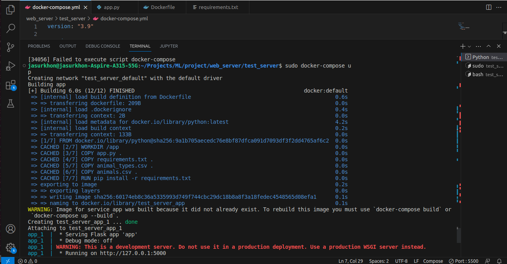
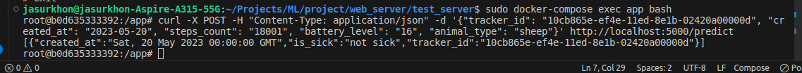
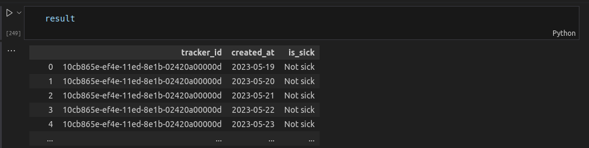

# Ежедневное состояние животных 

Этот модель состоит из датасетов которые представляют собой данные собранные с множества трекеров и животных за длительное время, нужно узнать за каждый день является ли животное больным или нет, алгоритм без тренера

tracker-id это уникальное id каждого животного

created_at - время за которое снято состояние животного

battery_level - уровень батареи трекера

steps_count - количество шагов до этого времени


## Зависимости

Зависимости в файле requirements.txt

## Результат:
1) Запуск модели через docker-compose



2) Скриншот полученного результата по curl относительно API в докере:



3) Пример одной из тестовых кейсов:
    ```
        curl -X POST -H "Content-Type: application/json" -d '{"tracker_id": "10cb865e-ef4e-11ed-8e1b-02420a00000d", "created_at": "2023-05-20", "steps_count": "18001", "battery_level": "16", "animal_type": "sheep"}' http://localhost:5000/predict
    ```

Сами результаты в целом приходят в таком формате:



